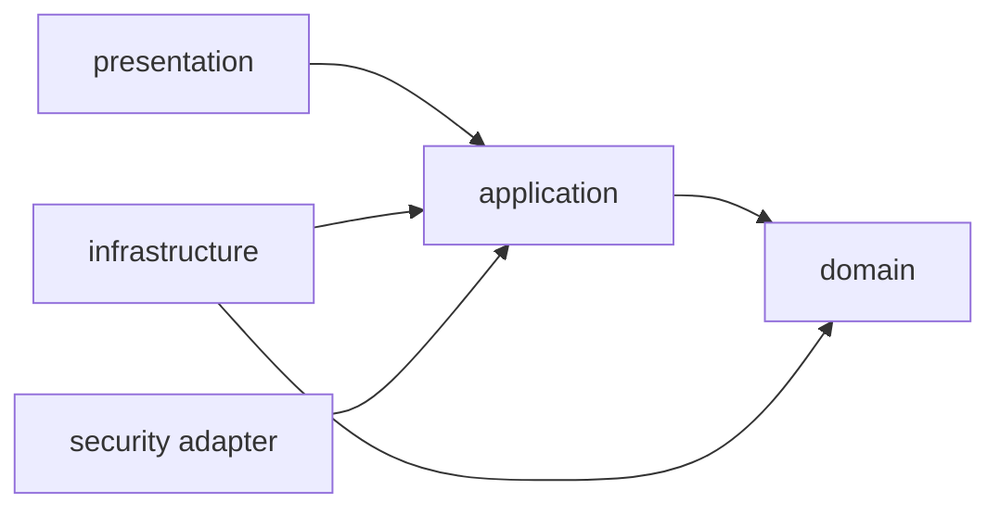

# 1차 MVP 아키텍처 기준선

이 문서는 1차 MVP를 구현하기 위한 모듈 경계와 의존 원칙을 정리한 초기 설계 기준선이다. 업무 규칙과 범위는 **확정**, 구현을 시작하기 위한 구조는 **추천안** 또는 **초기안**, 구현과 테스트로 검증해야 할 사항은 **열린 결정**으로 구분한다.

## 1. 모듈러 모놀리스 선택

**추천안:** 하나의 Spring Boot 애플리케이션과 하나의 관계형 데이터베이스 안에서 도메인별 모듈 경계를 지키는 모듈러 모놀리스를 사용한다.

- 1차 MVP의 회원, 매치, 참가, 구장·코트 기능은 함께 변경되고 한 트랜잭션으로 정합성을 맞춰야 하는 흐름이 많다.
- 매치 취소와 활성 참가 취소처럼 여러 도메인이 함께 성공하거나 롤백되어야 하는 규칙을 로컬 트랜잭션으로 다룰 수 있다.
- 배포 단위와 운영 복잡도를 작게 유지하면서도 패키지 경계와 의존 규칙으로 책임을 분리할 수 있다.
- 향후 결제나 알림이 추가되더라도 먼저 모듈 경계를 검증한 뒤 분리 필요성을 판단할 수 있다.

모듈러 모놀리스가 모든 코드를 자유롭게 참조해도 된다는 뜻은 아니다. 다른 모듈의 Controller, DTO 또는 Repository 구현을 직접 참조하지 않고, 필요한 협력은 애플리케이션 계층의 명시적인 계약을 통해 드러내는 것을 기본 방향으로 한다. 마이크로서비스, 분산 트랜잭션, 메시지 큐, Outbox와 CQRS는 1차 MVP에서 선택하지 않는다.

## 2. 도메인 경계와 모듈 책임

| 모듈 | 소유하는 책임 | 소유하지 않는 책임 | 결정 상태 |
|---|---|---|---|
| `member` | 회원 식별자, 이메일 기반 계정, 비밀번호 해시, 최소 프로필과 전역 역할 후보 | 특정 매치의 주최자·참가자 여부, 세션 처리 세부사항 | 경계 **추천안** |
| `venue` | 운영자가 준비한 구장·코트 정보의 조회 모델, 구장과 코트의 소속 관계 | 실제 대관 가능 여부, 시간대 예약, 결제 | 경계 **확정** |
| `match` | 주최자 관계, 코트 선택, 일정, 정원, 매치 상태와 모집 상태, 수정·마감·재개·취소 규칙 | 참가 관계의 생명주기, 구장 정보의 중복 소유 | 경계 **확정** |
| `participation` | 회원과 매치 사이의 하나뿐인 참가 관계, 참가·취소·재참가 상태 전이 | 주최자 소유권, 매치 자체의 모집 상태 변경 | 경계 **확정** |
| `security` | 세션 인증, 인증된 회원 식별자를 웹 요청에 연결하는 어댑터, 인증·CSRF 기술 구성 | 매치 소유권과 참가 가능 여부 같은 업무 판단 | 경계 **추천안** |
| `global` | 공통 오류 표현, 시간 추상화 후보, 최소한의 공통 웹·설정 지원 | 회원·매치·참가의 업무 규칙과 모듈별 DTO | 경계 **추천안** |

`Host`와 `Participant`는 전역 역할이 아니다. 주최자는 `match`가 소유한 회원과 매치의 관계이고, 참가자는 `participation`이 소유한 회원과 매치의 관계다. 같은 회원이 두 관계를 동시에 가질 수 있고, 자신의 참가를 취소해도 주최자 관계는 유지된다.

구장과 코트는 정보 제공용 시드 데이터다. `match`는 코트만 참조하며 구장을 중복 참조하지 않는다. 코트의 실제 대관 가능 여부를 이 모듈 경계로 보장하지 않는다.

## 3. 모듈 간 협력

### 3.1 기본 협력 원칙

- 한 모듈은 다른 모듈의 내부 패키지나 영속성 구현이 아니라 공개된 애플리케이션 계약을 통해 필요한 정보나 명령을 요청한다.
- 도메인 객체끼리 순환 참조를 만들지 않는다. 모듈 간 전달 값은 식별자와 유스케이스에 필요한 최소 값으로 제한하는 것을 우선 검토한다.
- 여러 모듈의 규칙을 함께 적용하는 유스케이스는 애플리케이션 계층이 순서를 조정한다.
- 조회 화면을 위해 여러 모듈의 데이터를 조합하는 위치는 애플리케이션 조회 서비스 또는 전용 조회 어댑터 후보이며, 이를 이유로 도메인 경계를 합치지 않는다.
- 다른 모듈의 테이블을 임의로 갱신하는 Repository 호출은 피한다. 단일 데이터베이스를 공유해도 변경 책임은 해당 모듈에 남긴다.

### 3.2 대표 협력 흐름

| 유스케이스 | 협력 흐름 | 지켜야 할 규칙 |
|---|---|---|
| 매치 개설 | 인증 회원 확인 → `venue`에서 코트 존재 확인 → `match` 생성 → 주최자 참가 선택 시 `participation` 생성 | 주최자 참가도 정원에 포함하며 boolean 컬럼으로 대신하지 않는다. |
| 매치 조회 | `match` 조회 → 코트와 구장 표시 정보 결합 → 활성 참가 수를 이용해 남은 자리 파생 | 저장 값과 파생 값을 구분하고 취소 참가자는 활성 수에서 제외한다. |
| 참가·재참가 | `match`의 상태·모집 상태·시작 시각·정원 확인 → `participation` 생성 또는 상태 전이 | 중복 활성 관계와 정원 초과가 없어야 한다. 동시성 해법은 아직 결정하지 않는다. |
| 참가 취소 | 참가 가능 시간과 현재 참가 상태 확인 → `participation` 상태 전이 | 주최자의 참가 취소도 주최자 관계를 삭제하지 않는다. |
| 매치 수정 | 주최자 확인 → 상태·시각·수정 필드 정책 확인 → 필요 시 활성 참가 수 확인 → `match` 변경 | 감소한 정원이 활성 참가 수보다 작아질 수 없다. 정원 증가가 모집을 자동 재개하지 않는다. |
| 모집 재개 | 주최자 확인 → 매치 상태·시작 시각 확인 → 활성 참가 수와 정원 비교 → 모집 상태 변경 | 남은 자리가 있을 때만 `OPEN`으로 전이한다. |
| 매치 취소 | 주최자 확인 → `match`를 `CANCELLED`로 전이 → 활성 참가를 `CANCELLED_BY_MATCH`로 전이 | 두 변경은 함께 성공하거나 함께 롤백되어야 한다. |

모듈 공개 계약의 Java 인터페이스명과 위치, Repository 인터페이스의 위치는 정하지 않는다. 구현할 유스케이스가 생겼을 때 가장 작은 계약부터 만든다.

## 4. 계층별 책임과 의존 방향

도메인 모듈 내부 구조의 **추천안**은 다음과 같다.

| 계층 | 책임 후보 | 두지 않는 것 |
|---|---|---|
| `presentation` | HTTP 요청·응답 변환, 형식 검증, 인증 식별자 전달, HTTP 상태 코드 선택 | 핵심 업무 규칙, 직접적인 영속성 조작 |
| `application` | 유스케이스 실행, 권한·소유권 검사 조정, 도메인 객체 협력, 트랜잭션 경계 설정 | 웹 DTO에 종속된 도메인 규칙, 특정 보안 컨텍스트 직접 조회 |
| `domain` | 상태, 허용 전이, 값과 불변식, 도메인 정책 | presentation DTO, `SecurityContextHolder`, Controller와 DB 기술 세부사항 |
| `infrastructure` | JPA 등 영속성 구현, 외부 기술 어댑터, 설정과 조회 최적화 구현 | 새로운 업무 규칙의 소유 |

의존 방향은 다음을 지향한다.



- `domain`은 바깥 계층을 참조하지 않는다.
- `application`은 도메인 규칙을 호출하고 트랜잭션을 조정한다.
- `infrastructure`는 안쪽 계층이 정의한 필요를 구현하는 방향으로 의존한다. 포트의 정확한 위치는 열린 결정이다.
- 인증된 회원 ID는 웹·보안 경계에서 얻어 애플리케이션 유스케이스에 전달한다. 도메인과 핵심 유스케이스가 `SecurityContextHolder`를 직접 조회하지 않는다.
- Controller는 요청 형식과 응답 변환에 집중하고, 참가 가능 여부나 정원 감소 가능 여부를 스스로 계산하지 않는다.
- `global`을 편의를 위한 범용 저장소로 사용하지 않는다. 두 모듈 이상에서 실제로 같은 의미를 갖는 기술적 관심사만 둔다.

## 5. 패키지 구조 추천안

아래 구조는 구현 선택을 안내하는 **추천안**이며 실제 패키지를 생성하라는 지시가 아니다. 각 수직 기능을 구현할 때 필요한 패키지만 만들고, 빈 계층 패키지나 `package-info.java`를 미리 만들지 않는다. 세부 패키지명은 구현 중 바꿀 수 있다.

```text
com.guseoh.futmatch
├─ member
│  ├─ presentation
│  ├─ application
│  ├─ domain
│  └─ infrastructure
├─ venue
│  ├─ presentation
│  ├─ application
│  ├─ domain
│  └─ infrastructure
├─ match
│  ├─ presentation
│  ├─ application
│  ├─ domain
│  └─ infrastructure
├─ participation
│  ├─ presentation
│  ├─ application
│  ├─ domain
│  └─ infrastructure
├─ security
└─ global
```

작은 기능에서 네 계층이 모두 필요하다고 가정하지 않는다. 예를 들어 읽기 전용 구장 조회가 단순하다면 불필요한 추상화나 빈 패키지를 추가하지 않는다. 반대로 핵심 상태 전이와 불변식은 Controller나 영속성 구현에 흩어지지 않게 한다.

## 6. 주요 트랜잭션 경계

**추천안:** 상태를 바꾸는 유스케이스의 애플리케이션 진입점을 트랜잭션 경계로 삼는다. 아래 표는 원자적으로 보여야 하는 업무 단위이며, 트랜잭션 애노테이션 위치나 락·쿼리 구현을 확정하지 않는다.

| 유스케이스 | 같은 트랜잭션에 포함할 변경 | 실패 시 보장 |
|---|---|---|
| 회원가입 | 이메일 중복 확인과 회원 생성 | 중복 또는 저장 실패 시 회원이 남지 않는다. |
| 매치 개설 | 매치 생성, `hostParticipates` 선택 시 주최자의 `CONFIRMED` 참가 생성 | 참가 생성까지 요청한 경우 둘 중 하나만 남지 않는다. |
| 참가·재참가 | 참가 가능 조건과 정원 확인, 참가 행 생성 또는 `CANCELLED_BY_MEMBER → CONFIRMED` 전이 | 실패 요청이 참가 상태나 정원 계산 결과를 바꾸지 않는다. |
| 참가 취소 | 시간·상태 확인, `CONFIRMED → CANCELLED_BY_MEMBER` 전이 | 중복 요청으로 자리가 두 번 복구된 것처럼 보이지 않는다. |
| 매치 수정 | 소유권·상태 확인, 활성 참가 수 검증, 허용 필드 변경 | 정원이 활성 참가 수보다 작은 상태가 저장되지 않는다. |
| 모집 마감·재개 | 소유권과 허용 조건 확인, 모집 상태 변경 | 재개 조건이 실패하면 기존 모집 상태를 유지한다. |
| 매치 취소 | `SCHEDULED → CANCELLED`, 모든 활성 참가의 `CONFIRMED → CANCELLED_BY_MATCH` 전이 | 매치와 참가 취소가 함께 커밋되거나 함께 롤백된다. |

목록·상세 조회는 상태 변경 트랜잭션과 같은 수준의 경계를 강제하지 않는다. 다만 하나의 응답에서 활성 참가 수와 매치 상태를 조합할 때 어느 시점의 일관성을 제공할지는 실제 조회 방식과 테스트에서 확인한다.

마지막 자리 동시 참가, 참가와 정원 감소의 경합, 참가와 매치 취소의 경합을 해결할 구체 방식은 **열린 결정**이다. 비관적 락, 낙관적 락, 조건부 원자적 갱신 등을 미리 선택하지 않고 재현 가능한 동시성 테스트와 데이터 모델을 바탕으로 결정한다.

## 7. 향후 결제·예약·알림의 위치

결제, 환불, 실제 코트 시간대 예약과 알림은 1차 MVP 범위 밖이며 현재 모듈의 필드나 상태로 미리 끼워 넣지 않는다.

- 실제 코트 대관을 도입하면 정보 카탈로그인 `venue`와 별개의 `reservation` 모듈 후보를 우선 검토한다.
- 결제를 도입하면 `payment`를 최상위 형제 모듈 후보로 두고 PG 연동 구현은 그 모듈의 infrastructure에 둔다.
- 알림을 도입하면 `notification`을 최상위 형제 모듈 후보로 두고, 업무 사실을 어떤 방식으로 전달할지는 별도로 결정한다.
- 외부 시스템 실패가 포함되는 시점에 재시도, 멱등성, 보상, 동기·비동기, 메시지 큐와 Outbox 필요성을 비교한다. 현재는 어느 방식도 확정하지 않는다.

## 8. 열린 결정

| 항목 | 현재 상황 | 선택지 | 현재 추천안 | 결정 시점 | 변경 영향 |
|---|---|---|---|---|---|
| Repository 인터페이스 위치 | 계층 의존 원칙만 정해짐 | domain / application | 추천안 없음 | 첫 영속성 유스케이스 구현 전 | 패키지 의존, 테스트 대역, infrastructure 구현 위치 |
| 모듈 공개 계약 형태 | 매치·참가 등 모듈 간 협력이 필요함 | 애플리케이션 서비스 계약 / 포트 / 최소 조회 계약 | 유스케이스별 최소 계약부터 도입 | 첫 교차 모듈 유스케이스 구현 시 | 순환 의존, DTO와 식별자 전달 방식 |
| 현재 참가 인원 처리 | 정원 검증과 조회에 활성 참가 수가 필요함 | 매번 집계 / `matches`에 저장 / 혼합 | ERD 문서의 열린 결정과 함께 검증 | 참가 유스케이스와 성능 테스트 전 | 트랜잭션 경계, 쿼리, 동시성 제어, 응답 파생 값 |
| 마지막 자리 동시성 | 단순 선조회만으로 정원 불변식을 보장할 수 없음 | 비관적 락 / 낙관적 락 / 조건부 갱신 등 | 추천안 없음 | 동시 참가 테스트를 작성할 때 | Repository 쿼리, 실패 응답, 재시도 정책 |
| 시간 추상화 | 시작 시각과 현재 시각 비교가 여러 규칙에 사용됨 | 시스템 시계 직접 사용 / 주입 가능한 시간 제공자 | 주입 가능한 시간 경계를 우선 검토 | 첫 시간 기반 규칙 구현 시 | 도메인 API, 테스트 결정성, `global` 범위 |
| 세부 내부 패키지 | 최상위 모듈과 계층 후보만 제시함 | 기능 중심 세분화 / 계층 중심 세분화 | 필요한 코드가 생길 때만 세분화 | 각 수직 기능 구현 시 | import와 가시성, 탐색성 |

## 9. 재검토 조건

다음 사실이 확인되면 현재 경계나 배포 구조를 재검토한다.

- 팀, 참가 승인, 대기자 자동 승급이 도입되어 참가 모델의 책임이 크게 확장될 때
- 실제 코트 예약과 결제가 추가되어 외부 시스템 실패와 보상 흐름이 핵심이 될 때
- 특정 모듈만 독립적으로 배포·확장해야 한다는 측정 근거가 생길 때
- 모듈 사이 순환 의존이나 직접 테이블 갱신이 반복되어 현재 공개 계약으로 협력이 어려울 때
- 동시성 테스트나 운영 지표에서 정원 불변식 또는 조회 성능 문제가 재현될 때
- 인증 클라이언트와 배포 구성이 바뀌어 서버 세션이 더 이상 적합하지 않을 때

재검토는 기술 도입 자체가 목적이 아니라, 확인된 문제와 불변식, 후보 비교, 선택의 영향, 구현·테스트 결과를 함께 기록하는 방식으로 진행한다.
