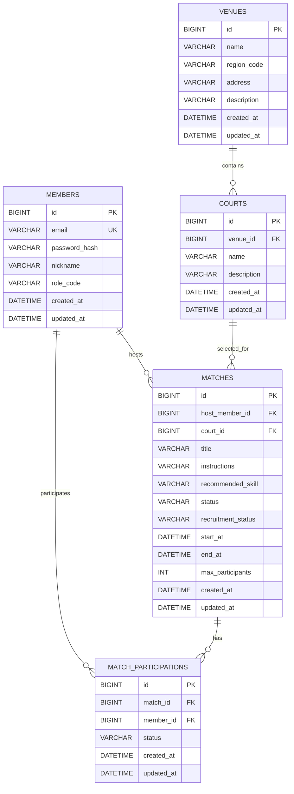

# 1차 MVP ERD 기준선

이 문서는 MySQL을 대상으로 한 1차 MVP의 논리 데이터 모델과 물리 제약 후보를 정리한다. DDL, Flyway SQL과 JPA Entity 매핑은 포함하지 않는다. 업무상 관계와 상태는 **확정**, 컬럼 타입·길이·인덱스·삭제 방식은 **초기안**, **추천안** 또는 **열린 결정**으로 구분한다.

## 1. 범위와 모델링 원칙

- 1차 MVP 테이블은 `members`, `venues`, `courts`, `matches`, `match_participations` 다섯 개다.
- `matches`는 `court_id`만 저장한다. `venue_id`는 `courts`를 통해 알 수 있으므로 중복 저장하지 않는다.
- 주최자 관계는 `matches.host_member_id`, 참가 관계는 `match_participations`로 각각 표현한다.
- 주최자가 참가할 때도 `match_participations` 행을 사용하며 `matches`에 참가 여부 boolean을 두지 않는다.
- 활성 참가자는 `status = CONFIRMED`인 참가 관계만 뜻한다. `CANCELLED_BY_MEMBER`와 `CANCELLED_BY_MATCH`는 정원에 포함하지 않는다.
- 현재 참가 인원과 남은 자리는 저장 여부가 결정되지 않았다. 아래 1차 모델에는 중복 저장하지 않고 파생 값으로 표현하지만, 이는 최종 결정이 아니다.
- 실제 코트 시간대 예약, 결제, 환불, 알림과 대기자 데이터는 이 ERD에 포함하지 않는다.

## 2. Mermaid ERD

관계의 자식 쪽은 각각 정확히 한 부모를 참조하는 것을 전제로 한다. 부모 쪽 `0..N`은 아직 매치나 참가가 없는 회원, 코트가 없는 구장, 매치가 없는 코트도 데이터상 가능하다는 뜻이다.

## 3. 주요 엔티티와 관계

| 부모 | 자식 | 관계와 FK 후보 | 의미 | 결정 상태 |
|---|---|---|---|---|
| `members` | `matches` | `matches.host_member_id → members.id` | 회원 한 명이 여러 매치를 주최할 수 있다. | 관계 **확정**, FK **추천안** |
| `venues` | `courts` | `courts.venue_id → venues.id` | 코트는 하나의 구장에 속한다. | 관계 **확정**, FK **추천안** |
| `courts` | `matches` | `matches.court_id → courts.id` | 매치는 하나의 코트를 선택한다. 실제 대관을 뜻하지 않는다. | 관계 **확정**, FK **추천안** |
| `members` | `match_participations` | `match_participations.member_id → members.id` | 회원은 여러 매치에 참가할 수 있다. | 관계 **확정**, FK **추천안** |
| `matches` | `match_participations` | `match_participations.match_id → matches.id` | 매치는 여러 참가 관계를 가진다. | 관계 **확정**, FK **추천안** |

주최자와 참가자의 관계는 독립적이다. `host_member_id`와 같은 회원의 참가 행이 함께 존재할 수 있으며, 그 행이 `CONFIRMED`일 때만 주최자도 활성 참가자 수와 정원에 포함된다.

## 4. 테이블별 핵심 컬럼

타입은 MySQL 물리 모델의 **초기 후보**다. 문자열 길이와 날짜·시간 타입의 최종 선택은 구현 전에 다시 확인한다. `DATETIME` 표기는 `DATETIME(6)`과 `TIMESTAMP` 등을 아직 구분하지 않았다는 뜻이다.

### 4.1 `members`

| 컬럼명 | 타입 후보 | NULL | 키 또는 제약 후보 | 설명 | 결정 상태 |
|---|---|---:|---|---|---|
| `id` | `BIGINT` | 불가 | PK | 내부 회원 식별자 | PK **추천안**, 타입 **초기안** |
| `email` | `VARCHAR(255)` | 불가 | UNIQUE 후보 | 로그인 식별자. 정규화·대소문자 비교 정책은 구현 전에 확인한다. | 필수·유일 업무 의미 **확정**, 길이 **초기안** |
| `password_hash` | `VARCHAR(255)` | 불가 |  | 복호화 가능한 비밀번호가 아닌 적응형 해시 결과 | 저장 원칙 **확정**, 길이 **초기안** |
| `nickname` | `VARCHAR(30)` | 불가 | UNIQUE 여부 열린 결정 | 최소 프로필 표시명 | 필수 **초기안**, 길이 **초기안** |
| `role_code` | `VARCHAR(20)` | 불가 | 허용 코드 후보: `USER`, `ADMIN` | 전역 역할. Host와 Participant를 저장하지 않는다. | 코드·길이 **초기안** |
| `created_at` | `DATETIME` | 불가 |  | 생성 시각 | 컬럼 **추천안**, 타입 **열린 결정** |
| `updated_at` | `DATETIME` | 불가 |  | 마지막 변경 시각 | 컬럼 **추천안**, 타입 **열린 결정** |

회원 상태 컬럼은 상태 코드와 탈퇴·정지 정책이 결정되지 않았으므로 1차 후보에 넣지 않는다. 정책을 도입할 때 로그인 허용, 기존 매치·참가 참조와 개인정보 처리까지 함께 설계한다.

### 4.2 `venues`

| 컬럼명 | 타입 후보 | NULL | 키 또는 제약 후보 | 설명 | 결정 상태 |
|---|---|---:|---|---|---|
| `id` | `BIGINT` | 불가 | PK | 구장 식별자 | PK **추천안**, 타입 **초기안** |
| `name` | `VARCHAR(100)` | 불가 |  | 구장 표시명 | 컬럼 **추천안**, 길이 **초기안** |
| `region_code` | `VARCHAR(50)` | 가능 |  | 검색·표시에 사용할 일반화된 지역 값 후보. 경기도 전용 enum으로 만들지 않는다. | 컬럼·표현 **초기안** |
| `address` | `VARCHAR(255)` | 불가 |  | 구장 주소 표시값 | 컬럼 **추천안**, 길이 **초기안** |
| `description` | `VARCHAR(1000)` 또는 `TEXT` | 가능 |  | 구장 안내 정보 후보 | 컬럼·타입 **초기안** |
| `created_at` | `DATETIME` | 불가 |  | 생성 시각 | 컬럼 **추천안**, 타입 **열린 결정** |
| `updated_at` | `DATETIME` | 불가 |  | 마지막 변경 시각 | 컬럼 **추천안**, 타입 **열린 결정** |

행정구역 정규화나 별도 지역 테이블은 현재 요구사항이 아니다. 지역 필터의 실제 요구가 구체화될 때 `region_code`의 형식과 NULL 허용 여부를 결정한다.

### 4.3 `courts`

| 컬럼명 | 타입 후보 | NULL | 키 또는 제약 후보 | 설명 | 결정 상태 |
|---|---|---:|---|---|---|
| `id` | `BIGINT` | 불가 | PK | 코트 식별자 | PK **추천안**, 타입 **초기안** |
| `venue_id` | `BIGINT` | 불가 | FK → `venues.id` | 소속 구장 | 관계 **확정**, FK **추천안** |
| `name` | `VARCHAR(100)` | 불가 |  | 구장 안에서의 코트 표시명 | 컬럼 **추천안**, 길이 **초기안** |
| `description` | `VARCHAR(1000)` 또는 `TEXT` | 가능 |  | 코트 안내 정보 후보 | 컬럼·타입 **초기안** |
| `created_at` | `DATETIME` | 불가 |  | 생성 시각 | 컬럼 **추천안**, 타입 **열린 결정** |
| `updated_at` | `DATETIME` | 불가 |  | 마지막 변경 시각 | 컬럼 **추천안**, 타입 **열린 결정** |

코트 행은 1차 MVP에서 정보 제공용이다. 실제 시간대 예약이나 대관 가능 상태를 나타내는 컬럼을 추가하지 않는다.

### 4.4 `matches`

| 컬럼명 | 타입 후보 | NULL | 키 또는 제약 후보 | 설명 | 결정 상태 |
|---|---|---:|---|---|---|
| `id` | `BIGINT` | 불가 | PK | 매치 식별자 | PK **추천안**, 타입 **초기안** |
| `host_member_id` | `BIGINT` | 불가 | FK → `members.id` | 매치 주최자 | 관계·필수 **확정**, FK **추천안** |
| `court_id` | `BIGINT` | 불가 | FK → `courts.id` | 선택한 코트. `venue_id`는 저장하지 않는다. | 관계·필수 **확정**, FK **추천안** |
| `title` | `VARCHAR(100)` | 불가 |  | 매치 제목 | 필수 **확정**, 길이 **초기안** |
| `instructions` | `VARCHAR(1000)` 또는 `TEXT` | 가능 |  | 참가 안내 사항 | NULL·길이·타입 **초기안** |
| `recommended_skill` | `VARCHAR(32)` | 불가 | 허용 코드 후보 | 참가 제한이 아닌 안내용 권장 실력 | 안내 의미 **확정**, 코드·저장 타입 **초기안** |
| `status` | `VARCHAR(20)` | 불가 | `SCHEDULED`, `CANCELLED` | 매치 상태 | 코드 **확정**, 저장 타입 **초기안** |
| `recruitment_status` | `VARCHAR(20)` | 불가 | `OPEN`, `CLOSED` | 모집 상태 | 코드 **확정**, 저장 타입 **초기안** |
| `start_at` | `DATETIME` | 불가 | `end_at > start_at` 검사 후보 | 매치 시작 시각 | 필수·비교 규칙 **확정**, 타입 **열린 결정** |
| `end_at` | `DATETIME` | 불가 | `end_at > start_at` 검사 후보 | 매치 종료 시각 | 필수·비교 규칙 **확정**, 타입 **열린 결정** |
| `max_participants` | `INT` | 불가 | `>= 1` 검사 후보 | 주최자 참가를 포함한 최대 활성 참가자 수 | 의미 **확정**, 최솟값 **초기안**, 상한 **열린 결정** |
| `created_at` | `DATETIME` | 불가 |  | 생성 시각 | 컬럼 **추천안**, 타입 **열린 결정** |
| `updated_at` | `DATETIME` | 불가 |  | 마지막 변경 시각 | 컬럼 **추천안**, 타입 **열린 결정** |

권장 실력 허용 코드의 **초기안**은 `ANY`, `INTRODUCTORY`, `BEGINNER`, `INTERMEDIATE_OR_ABOVE`다. 현재 참가 인원, 남은 자리, `hostParticipates`는 이 표의 저장 컬럼으로 확정하지 않는다.

### 4.5 `match_participations`

| 컬럼명 | 타입 후보 | NULL | 키 또는 제약 후보 | 설명 | 결정 상태 |
|---|---|---:|---|---|---|
| `id` | `BIGINT` | 불가 | PK | 참가 관계 식별자 | PK **추천안**, 타입 **초기안** |
| `match_id` | `BIGINT` | 불가 | FK → `matches.id`, 복합 UNIQUE 후보 | 참가 대상 매치 | 관계·필수 **확정**, FK **추천안** |
| `member_id` | `BIGINT` | 불가 | FK → `members.id`, 복합 UNIQUE 후보 | 참가 회원 | 관계·필수 **확정**, FK **추천안** |
| `status` | `VARCHAR(32)` | 불가 | 허용 상태 코드 후보 | 참가 관계의 현재 상태 | 코드 **확정**, 저장 타입 **초기안** |
| `created_at` | `DATETIME` | 불가 |  | 최초 참가 관계 생성 시각 | 컬럼 **추천안**, 타입 **열린 결정** |
| `updated_at` | `DATETIME` | 불가 |  | 마지막 상태 변경 시각 | 컬럼 **추천안**, 타입 **열린 결정** |

참가 상태 코드는 `CONFIRMED`, `CANCELLED_BY_MEMBER`, `CANCELLED_BY_MATCH`다. `UNIQUE(match_id, member_id)`는 한 회원이 같은 매치에 하나의 참가 관계만 갖는 업무 규칙을 DB에서도 방어하기 위한 후보이며, 취소 후 재참가는 새 행 추가가 아니라 기존 행의 허용 상태 전이로 표현한다.

## 5. 키·제약 후보 요약

| 대상 | 후보 제약 | 보장하려는 내용 | 한계 또는 비고 |
|---|---|---|---|
| 모든 테이블 | 단일 `id` PK, NOT NULL | 안정적인 행 식별 | 키 생성 전략은 구현 시 결정한다. |
| `members.email` | UNIQUE, NOT NULL | 로그인 식별자 중복 방지 | 대소문자·공백·정규화 후 같은 이메일의 기준을 먼저 정해야 한다. |
| `members.nickname` | NOT NULL, UNIQUE 여부 미정 | 최소 프로필 값 존재 | 닉네임 중복 허용 정책이 열린 결정이다. |
| 각 FK 컬럼 | FK, NOT NULL | 부모 없는 매치·코트·참가 관계 방지 | 삭제 동작은 별도로 결정한다. |
| `match_participations(match_id, member_id)` | 복합 UNIQUE, 두 컬럼 NOT NULL | 같은 회원의 매치별 관계 중복 방지 | 허용 상태 전이와 마지막 자리 경합까지 해결하지는 않는다. |
| `matches.start_at`, `matches.end_at` | `end_at > start_at` CHECK 후보 | 역전되거나 길이가 0인 시간 범위 방지 | 애플리케이션 검증도 필요하며 MySQL 버전을 확인한다. |
| `matches.max_participants` | `max_participants >= 1` CHECK 후보 | 0 이하 정원 방지 | 활성 참가 수 이하로 감소하는 교차 행 규칙은 보장하지 못한다. |
| 상태 코드 컬럼 | 허용 값 검사 후보 | 알 수 없는 상태 코드 저장 방지 | DB CHECK, 문자열 매핑, native ENUM 중 무엇을 쓸지는 미정이다. 상태 전이 자체는 보장하지 않는다. |

일반적인 행 단위 CHECK만으로 `CONFIRMED` 참가 수가 `max_participants`를 넘지 않는다는 교차 행 불변식을 보장할 수 있다고 가정하지 않는다. 정원 감소와 동시 참가를 포함한 트랜잭션·동시성 설계가 별도로 필요하다.

## 6. 파생 값과 정원 불변식

현재 모델에서 논리적 파생 값은 다음과 같다.

- `activeParticipationCount = match_id가 같고 status = CONFIRMED인 행의 수`
- `remainingSlots = maxParticipants - activeParticipationCount`
- 주최자가 `CONFIRMED` 참가 행을 가지면 위 집계에 동일하게 포함한다.

**확정 불변식:** `activeParticipationCount <= maxParticipants`이며 `remainingSlots >= 0`이어야 한다. 계산된 음수를 0으로 감춰 응답하기보다 저장 정합성 위반으로 탐지해야 한다. 조회 시 집계할지 `matches`에 현재 인원을 저장할지는 열린 결정이다.

## 7. 삭제 정책 후보

1차 MVP에는 회원·구장·코트·매치의 물리 삭제 유스케이스가 없다. 참가 취소와 매치 취소는 행 삭제가 아니라 상태 전이로 보존한다.

| 관계 | 초기 추천안 | 이유 | 열린 부분 |
|---|---|---|---|
| `members → matches` | FK `RESTRICT`/`NO ACTION` 후보 | 주최자가 사라져 기존 매치의 책임 관계가 끊기는 것을 막는다. | 탈퇴 회원 익명화·보존 정책 |
| `members → match_participations` | FK `RESTRICT`/`NO ACTION` 후보 | 참가 관계와 매치 이력을 보존한다. | 개인정보 삭제와 감사 이력 범위 |
| `venues → courts` | FK `RESTRICT`/`NO ACTION` 후보 | 운영 시드 데이터의 우발적 연쇄 삭제를 막는다. | 운영자 관리 기능 도입 시 비활성화 방식 |
| `courts → matches` | FK `RESTRICT`/`NO ACTION` 후보 | 과거·예정 매치가 참조하는 코트를 삭제하지 않는다. | 코트 폐쇄·비활성 상태 모델 |
| `matches → match_participations` | FK `RESTRICT`/`NO ACTION` 후보 | 매치 취소 시 참가 행을 상태로 보존한다. | 법적·운영 보존 기간과 물리 정리 정책 |

DB의 FK 삭제 동작과 JPA cascade/orphan removal은 서로 다른 설정이다. 둘을 같은 정책으로 간주하지 않고 Entity 매핑 시 별도로 검토한다. 회원 탈퇴 개인정보 처리 방식이 정해지기 전에는 soft delete 컬럼이나 연쇄 삭제를 확정하지 않는다.

## 8. 최소 인덱스 후보

아래는 예상 조회를 출발점으로 한 **초기 후보**일 뿐 최종 인덱스가 아니다. PK와 UNIQUE 제약으로 생성되는 인덱스, FK 인덱스의 실제 생성 여부와 중복을 MySQL 버전·DDL에서 확인한 뒤 조정한다.

| 테이블 | 인덱스 후보 | 근거가 되는 조회 | 비고 |
|---|---|---|---|
| `courts` | `(venue_id)` | 구장별 코트 목록 | FK 지원 인덱스와 중복 여부 확인 |
| `matches` | `(status, recruitment_status, start_at)` | 기본 공개 탐색 목록 | 남은 자리는 파생 값이라 이 인덱스만으로 필터가 끝나지 않는다. |
| `matches` | `(host_member_id, start_at)` | 내가 주최한 매치 목록 | 최종 정렬 방향과 페이지 방식에 따라 순서 재검토 |
| `matches` | `(court_id, start_at)` | 코트·구장 기준 필터와 일정 조회 | 실제 필터 요구가 없으면 제거 후보 |
| `match_participations` | `(match_id, status)` | 주최자의 참가자 목록, 활성 참가 수 집계 | 복합 UNIQUE와 선두 컬럼 일부가 겹치는지 실행 계획 확인 |
| `match_participations` | `(member_id, status, match_id)` | 내 참가 매치 목록 | 매치 시작 시각 정렬을 위한 조인 비용을 측정해야 한다. |

Repository 쿼리, 데이터 분포와 페이지·정렬 계약이 정해진 뒤 `EXPLAIN`과 성능 측정으로 컬럼 순서, 정렬 방향, 커버링 여부와 삭제할 중복 인덱스를 결정한다.

## 9. 데이터 정합성 위험

| 위험 | 실패 예 | 현재 방어선 | 남은 결정 |
|---|---|---|---|
| 중복 참가 관계 | 동시 요청이 같은 회원·매치 행을 두 개 생성 | `UNIQUE(match_id, member_id)` 후보와 상태 전이 규칙 | 제약 충돌의 오류 변환과 재시도 여부 |
| 마지막 자리 경합 | 두 요청이 모두 한 자리가 남았다고 읽고 `CONFIRMED`가 됨 | 업무 불변식과 단일 유스케이스 트랜잭션 | 락·조건부 갱신 등 구체 해결 방식 |
| 정원 감소와 참가 경합 | 수정 검증 뒤 새 참가가 커밋되어 정원보다 활성 참가자가 많아짐 | 수정 시 활성 참가 수 검증 | 두 유스케이스 사이 동시성 제어 |
| 참가와 매치 취소 경합 | 취소 중인 매치에 참가 또는 재참가가 확정됨 | 상태 검증과 각각의 트랜잭션 경계 | 실행 순서와 충돌 검출 방식 |
| 부분 취소 | 매치만 취소되고 참가 행은 `CONFIRMED`로 남음 | 매치 취소와 활성 참가 변경을 한 트랜잭션으로 처리 | 일괄 갱신 방식과 실패 테스트 |
| 중복 참가 취소 | 같은 취소가 반복되어 저장 인원이나 응답이 두 번 변함 | 단일 참가 행과 상태 전이 검증 | 중복 취소 응답 정책, 인원 저장 시 원자성 |
| 주최자 관계 혼동 | 주최자 참가 취소가 매치 소유권까지 제거 | 별도 FK와 참가 행으로 모델링 | 조회 응답의 파생 필드 의미 |
| 구장 중복 정보 | 매치의 `venue_id`와 코트의 구장이 달라짐 | `matches`에는 `court_id`만 저장 | 없음. 조회는 코트를 통해 구장을 찾는다. |
| 시간 경계 불일치 | 서버·DB·클라이언트 시간대 차이로 시작 여부가 다르게 계산됨 | `현재 시각 >= startAt` 업무 규칙 | 저장 타입, 기준 시간대, 정밀도 |
| 상태 값은 유효하지만 전이는 불법 | `CANCELLED_BY_MATCH → CONFIRMED` 저장 | 도메인 상태 전이 규칙 | 벌크 갱신도 같은 규칙을 지키는 방법 |
| 이력 소실 | 하나의 참가 행 상태를 반복 변경해 과거 취소 시점이 사라짐 | `created_at`, `updated_at` 후보 | 별도 감사 이력 필요 여부 |
| 물리 삭제로 참조 손실 | 회원·매치 삭제가 이력을 연쇄 삭제 | FK 삭제 제한 후보 | 탈퇴·보존·익명화 정책 |

## 10. 열린 결정

| 항목 | 현재 상황 | 선택지 | 현재 추천안 | 결정 시점 | 변경 영향 |
|---|---|---|---|---|---|
| 현재 참가 인원 저장 | 정원과 남은 자리에 활성 참가 수가 필요함 | 매번 `CONFIRMED` 집계 / `matches`에 저장 / 혼합 | 작은 MVP 데이터에서는 집계를 먼저 검증하되 확정하지 않음 | 참가 Repository와 동시성 테스트 구현 전 | 컬럼, 쿼리, 트랜잭션, 동시성, 응답 파생 값 |
| 마지막 자리 동시 참가 | UNIQUE만으로 정원 초과를 막을 수 없음 | 비관적 락 / 낙관적 락 / 조건부 원자적 UPDATE 등 | 추천안 없음 | 재현 가능한 동시 참가 테스트 작성 시 | 스키마 보조 컬럼, Repository, 오류·재시도 정책 |
| 최종 인덱스 | 예상 조회만 있고 실제 쿼리·분포·실행 계획이 없음 | 현재 후보 조합 / 단일 인덱스 / 다른 복합 순서 | 현재 표를 측정 출발점으로만 사용 | API 조회 쿼리와 데이터 샘플 준비 후 | 쓰기 비용, 저장 공간, 조회 성능 |
| 시간 저장과 타임존 | 시간 비교 규칙은 확정됐지만 배포·클라이언트 기준이 없음 | UTC 저장 / 지역 시각과 zone 보존 등 | 추천안 없음 | API 시간 계약과 배포 환경 확정 전 | 컬럼 타입, 직렬화, 비교, 인덱스, 테스트 |
| 문자열 길이 | 제목·안내·닉네임 등의 초기값만 있음 | 현재 초기값 / 사용성 검증 후 조정 | 표의 길이를 초기 검증값으로 사용 | 요청 검증과 샘플 데이터 작성 시 | API 검증, 컬럼 변경, 오류 메시지 |
| 최대 정원 상한 | 최솟값 1의 초기 후보 외에는 범위 근거가 없음 | 상한 없음 / 업무 상한 설정 | 추천안 없음 | 매치 개설 검증 구현 전 | CHECK 후보, API 검증, 부하 범위 |
| 닉네임 유일성 | 중복 허용 여부가 승인되지 않음 | 중복 허용 / 전체 유일 | 추천안 없음 | 회원가입·프로필 수정 구현 전 | UNIQUE, 검증 쿼리, 오류 코드 |
| 회원 상태와 탈퇴 | 회원 상태 enum과 개인정보 정책이 없음 | 상태 없음 / 상태 도입, 삭제 / 익명화 / 제한 보존 | 추천안 없음 | 탈퇴·정지 기능 범위 결정 시 | `members`, FK 삭제 정책, 인증, 과거 이력 |
| 참가 감사 이력 | 단일 행의 현재 상태만 보존함 | 현재 상태만 / 상태 변경 이력 별도 보존 | 추천안 없음 | 운영·분쟁 대응 요구 확인 시 | 추가 테이블, 저장량, 개인정보 보존 |
| 참가 PK 형태 | 관계 유일성은 복합 UNIQUE가 담당함 | surrogate `id` + UNIQUE / 복합 PK | surrogate `id` + UNIQUE를 초기 후보로 사용 | Entity 식별자와 API 노출 정책 결정 시 | JPA 매핑, FK 확장, Repository 메서드 |
| 상태 코드 물리 표현 | 허용 코드는 정해졌지만 저장 기술은 미정 | 문자열 + CHECK / MySQL ENUM 등 | 변경 용이성을 비교한 뒤 결정 | 첫 Entity·DDL 설계 시 | 마이그레이션, 검증 위치, enum 변경 비용 |

열린 결정을 확정할 때는 해당 결론을 이 문서뿐 아니라 요구사항, API 계약과 실제 테스트에도 일관되게 반영한다.
